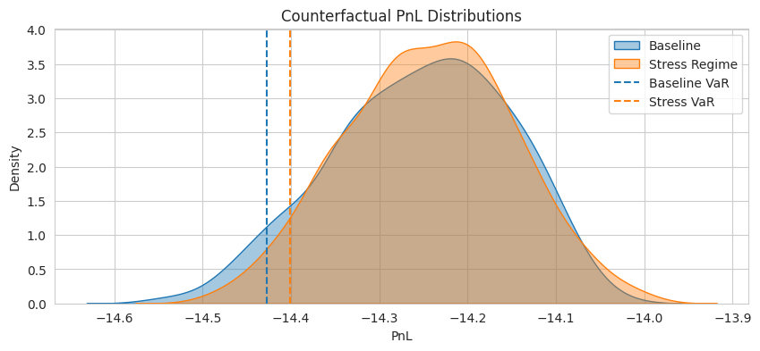

# FinD Generator

FinD_Generator is a research-grade probabilistic scenario generator for financial time series, built as an explicit and extensible implementation of the TimeGrad framework.

Its primary purpose is counterfactual market simulation: generating realistic return and volatility scenarios—especially tail events—that can be used to stress-test trading and execution strategies, rather than to maximize point-forecast accuracy.

---

### What this project is

A conditional TimeGrad implementation for financial time series:
- Uses Student-t marginals to handle heavy-tailed returns
- Transforms data into a Gaussian latent space (CDF → probit) and trains a diffusion model there
- Supports explicit conditioning on macro regimes and historical context
- Designed as infrastructure for downstream:
    - execution simulators
    - RL trading agents
    - scenario-based risk analysis

### What this project is not
- A production trading system
- An alpha-prediction model optimized for leaderboard metrics
- A fully specified multivariate copula model

For architectural details, see docs/architecture.md

---

## Usage

The project includes a convenience script `run.py` to handle data collection, training, and inference in a single pipeline.

### 1. First Run (Download Data & Train)

To download fresh data, train the model, and generate forecasts:

```bash
python run.py --download --epochs 10 --batch-size 64
```

### 2. Subsequent Runs (Use Local Data)

Once data is downloaded to `data/raw`, you can run training without the `--download` flag to use the cached parquet files:

```bash
python run.py --epochs 10
```

### 3. Key Arguments

- `--download`: Fetch fresh data from Yahoo Finance and FRED.
- `--epochs`: Number of training epochs (default: 1).
- `--batch-size`: Batch size (default: 64).
- `--num-samples`: Number of forecast samples to generate per series (default: 2).
- `--device`: `cpu` or `cuda` (automatically detected if omitted).

Forecasts are saved in checkpoints folder.

---

## Results

### 1. Probabilistic Forecasting
**Problem**: Standard diffusion models often fail to capture the 'Fat-tail' risks in financial markets.
**Solution**: Designed FinD_Generator, a regime-aware diffusion model extending TimeGrad with regime-aware FiLM and cross-attention layers

Metric | Vanilla | FinD_Generator
--- | --- | ---
CRPS | 0.0551 | 0.0609
MAE | 0.0828 | 0.0798
80% Coverage | 0.1667 | 0.0938

!

**Limitation**
Static regime embeddings are coarse due to:
- structural heterogeneity across a 50-year dataset
- compute constraints limiting regime granularity

Despite this, the model remains stable and generalizes reasonably under global context.

### 2. Stress Testing Simulation (Scenario Generation)
A dedicated ScenarioGenerator allows forced regime injection at inference time, enabling counterfactual experiments such as:
- synthetic crash scenarios
- volatility clustering amplification
- portfolio PnL sensitivity under regime shifts


