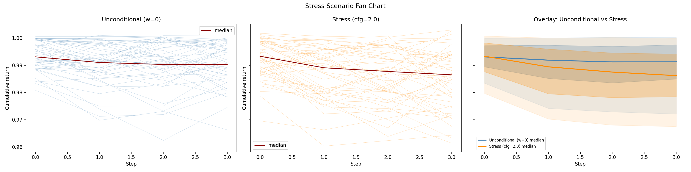

# FinD_Generator — Regime-Conditional Stress Scenario Generator

A conditional diffusion model (TimeGrad-style) that generates financial return
scenarios **conditioned on macro/market regimes**. Given a regime — bear market,
high inflation, stagflation — it produces return paths whose distribution is
statistically distinct from unconditional forecasts, verified in **8 of 9 regime
labels** (KS test + Cohen's d). Classifier-free guidance (CFG) provides a
continuous **stress-intensity dial**: forcing the bear regime at w=2 widens
portfolio VaR₉₅ by **56%** relative to unconditional scenarios.

All methods — this model, a vanilla unconditional TimeGrad, historical/block
bootstrap, and GARCH(1,1)-t — are evaluated in the **same canonical space**
(denoised-close log returns) on a **leakage-tested causal pipeline**
(2000–2024 S&P 500 + FRED macro data).

## Headline results

### 1. Regime conditioning works — and CFG scales it

The core claim: conditioning actually controls the generated distribution.
For each regime label, we compare samples generated *with* that regime forced
vs *without*, using KS tests and Cohen's d (full run, 200 samples/window):

| Regime | KS p | Cohen's d |
|---|---|---|
| market: bear | <0.001 | **0.872** |
| market: bull | <0.001 | −0.585 |
| macro: stagflation | <0.001 | 0.505 |
| macro: high_inflation | <0.001 | −0.312 |
| vol: high_vol | <0.001 | 0.183 |
| macro: recession | 0.134 | 0.056 (not significant — 108 rows) |

*(at CFG w=2; 8 of 9 labels significant — see [docs/cfg_sweep.md](docs/cfg_sweep.md))*

CFG acts as a **dial**: at w=0 conditioning is fully off (all d ≈ 0); effect
sizes rise monotonically with w. At w=4 (extreme-stress mode) bear reaches
d = 1.21 and even the underpowered recession regime becomes significant —
at the cost of calibration (coverage₀.₈ drops 0.66 → 0.54).

| w | 0.0 | 0.5 | 1.0 | 2.0 | 4.0 |
|---|---|---|---|---|---|
| bear Cohen's d (sweep, 32 windows) | −0.03 | 0.16 | 0.52 | 0.95 | 1.08 |

### 2. Stress demo — portfolio impact

Forcing the bear regime at w=2 on an example portfolio:

| Method | VaR₉₅ | ES₉₅ | VaR₉₉ | Max DD* |
|---|---|---|---|---|
| unconditional (w=0) | −0.0317 | −0.0415 | −0.0478 | −0.0817 |
| **bear stress (w=2)** | **−0.0495** | **−0.0599** | **−0.0669** | **−0.1058** |

VaR₉₅ widens by **56%** under the bear stress. No baseline below — bootstrap,
GARCH, or vanilla — can answer "generate 200 bear-market scenarios."



*\*Per-path 4-step drawdowns; not comparable to a multi-year continuous
drawdown (see limitations).*

Reproduce with two commands:

```bash
python -m src.stress_demo.scenario_run \
  --checkpoint runs/cfg_retrain__20260713-204619__seed0/checkpoints/model_best.pt \
  --regime '{"market_regime": "bear"}' --cfg-scale 2.0 \
  --num-scenarios 200 --run-dir runs/stress_bear --seed 0 --device cuda

python -m src.stress_demo.portfolio_stress \
  --scenario-npz runs/stress_bear/samples/scenario_returns.npz \
  --out-dir runs/stress_bear
```

### 3. Canonical comparison — where this model wins, and where it doesn't

All methods, same test windows, same evaluation space
(full table: [COMPARISON_TABLE.md](COMPARISON_TABLE.md)):

| Method | CRPS ↓ | coverage₀.₈ (→0.8) | kurtosis (real: 3.79†) | regime-conditional? |
|---|---|---|---|---|
| conditional (CFG w=2) | 0.0039 | 0.658 | **4.58** | **yes** |
| conditional (no CFG) | 0.0043 | 0.630 | 3.36 | yes |
| vanilla TimeGrad | 0.0035 | 0.706 | 14.83 | no |
| historical bootstrap | **0.0034** | **0.802** | 12.73 | no |
| block bootstrap | 0.0034 | **0.807** | 12.26 | no |
| GARCH(1,1)-t | 0.0039 | 0.966 (over) | 327.1 | no |

†real = wavelet-denoised test returns, the model's training target.

Honest reading: **bootstrap wins CRPS and coverage.** This model's value is
(a) the closest kurtosis/skewness match to the real distribution, and
(b) being the only method that can generate regime-conditional scenarios.
CFG w=2 additionally **dominates the non-CFG conditional on every metric**
(CRPS, coverage, PIT, and regime control) — the conditioning dropout acts as
a regularizer.

## Limitations (measured, not hidden)

1. **Bootstrap and vanilla beat this model on CRPS** (0.0034–0.0035 vs 0.0039)
   **and coverage** (0.80–0.81 vs 0.66). Classical methods win on unconditional
   metrics; none of them can condition on a regime.
2. **Recession is underpowered** (108 rows, 1.7% of data) — not significant at
   w≤2. **Stagflation is severely underpowered** (42 rows, 0.67%); its large
   effect size (d = 0.5–0.7) carries wide uncertainty.
3. **The model learns wavelet-denoised targets**, so its kurtosis (3.4–4.6)
   matches denoised returns (3.79), not raw returns (2.17). Raw-return
   references are reported alongside in every table.
4. **w=4 trades calibration for control**: coverage₀.₈ falls 0.66 → 0.54 and
   kurtosis inflates to 8.2. Use w=2 as the default; w=4 is an extreme-stress
   mode.
5. **Generated drawdowns are per-path over a 4-step horizon** and cannot be
   compared to multi-year continuous drawdowns of the historical series.
6. **PIT is non-uniform for all diffusion variants** (KS p ≈ 0) — calibration
   is imperfect across the board; only the bootstraps pass the PIT test.

## Rigor

- **Leakage-tested causal pipeline**: every feature at time t is proven to
  depend only on data ≤ t (`tests/test_no_leakage.py`, incl. a future-mutation
  invariance test: corrupting 22 future GDP quarters leaves gdp_qoq at t
  unchanged).
- **Metric implementations verified against analytic ground truth** on
  synthetic data (Gaussian CRPS/coverage, Student-t tail index, known-value
  drawdowns) — 90 tests.
- **Fair baselines**: vanilla TimeGrad retrained from scratch on the identical
  clean pipeline, same seed, same budget — the only difference is conditioning.
- **Every number above traces to a committed metrics JSON** under `runs/`
  (folders listed in [COMPARISON_TABLE.md](COMPARISON_TABLE.md)).
- Seeded runs, per-run folders, best-checkpoint selection by validation loss.

## Setup & training

```bash
pip install -r requirements.txt
pip install torch --index-url https://download.pytorch.org/whl/cu130  # GPU

# train conditional with CFG
python run.py --config configs/default.yaml --seed 0 \
  --run-name my_run --epochs 100 --cfg-dropout 0.1

# evaluate
python run.py --config configs/default.yaml --seed 0 --run-name my_eval \
  --eval --eval-checkpoint runs/my_run*/checkpoints/model_best.pt \
  --num-samples 200 --cfg-scale 2.0
```

Architecture and design docs: [docs/architecture.md](docs/architecture.md),
[docs/MASTER_SPEC.md](docs/MASTER_SPEC.md).