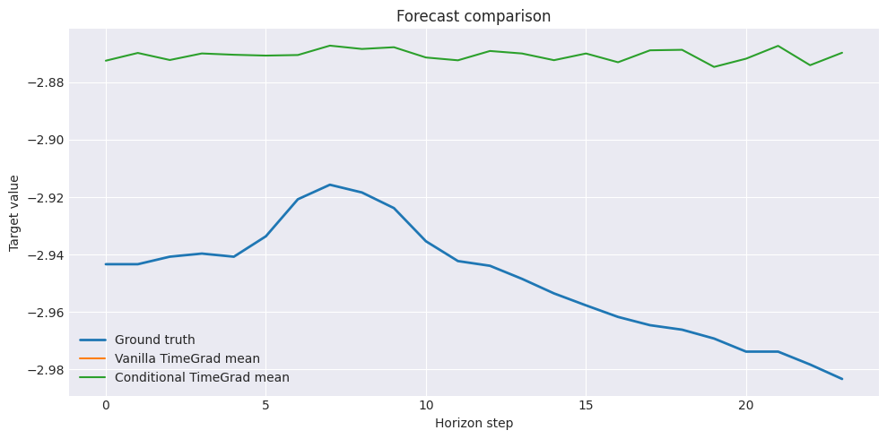
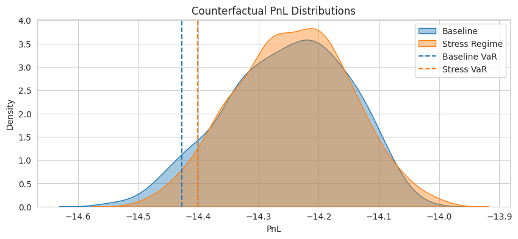
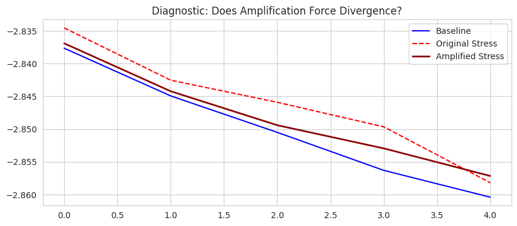

# FinD Generator

FinD_Generator is a research-grade probabilistic scenario generator for financial time series, built as an explicit and extensible implementation of the TimeGrad framework.

Its primary purpose is counterfactual market simulation: generating realistic return and volatility scenarios—especially tail events—that can be used to stress-test trading and execution strategies, rather than to maximize point-forecast accuracy.

---

### What this project is

A conditional TimeGrad implementation for financial time series:
- Uses Student-t marginals to handle heavy-tailed returns
- Transforms data into a Gaussian latent space (CDF → probit) and trains a diffusion model there
- Supports explicit conditioning on macro regimes and historical context
- Designed as infrastructure for downstream:
    - execution simulators
    - RL trading agents
    - scenario-based risk analysis

### What this project is not
- A production trading system
- An alpha-prediction model optimized for leaderboard metrics
- A fully specified multivariate copula model

For architectural details, see docs/architecture.md

---

## Usage

The project includes a convenience script `run.py` to handle data collection, training, and inference in a single pipeline.

### 1. First Run (Download Data & Train)

To download fresh data, train the model, and generate forecasts:

```bash
python run.py --download --epochs 10 --batch-size 64
```

### 2. Subsequent Runs (Use Local Data)

Once data is downloaded to `data/raw`, you can run training without the `--download` flag to use the cached parquet files:

```bash
python run.py --epochs 10
```

### 3. Key Arguments

- `--download`: Fetch fresh data from Yahoo Finance and FRED.
- `--epochs`: Number of training epochs (default: 1).
- `--batch-size`: Batch size (default: 64).
- `--num-samples`: Number of forecast samples to generate per series (default: 2).
- `--device`: `cpu` or `cuda` (automatically detected if omitted).

Forecasts are saved in checkpoints folder.

Checkpoints and run artifacts (`checkpoints/`, `runs/`) are not committed to this repo (see `.gitignore`) — they're local build products. To regenerate the checkpoints behind the Results below: `python run.py --epochs 100 --seed 0 --run-name retrain_d1` (FinD_Generator) and `python run.py --model vanilla --epochs 100 --seed 0 --run-name vanilla_retrain` (vanilla).

---

## Results

### 1. Probabilistic Forecasting
**Problem**: Standard diffusion models often fail to capture the 'Fat-tail' risks in financial markets.
**Solution**: Designed FinD_Generator, a regime-aware diffusion model extending TimeGrad with regime-aware FiLM and cross-attention layers

Metric | Vanilla | FinD_Generator
--- | --- | ---
CRPS | 0.00346 | 0.00433
MAE | 0.00457 | 0.00597
80% Coverage | 0.706 | 0.630

*Test-split evaluation, 200 samples/window, seed 0, same causally-fixed data pipeline for both models (see [docs/data_integrity.md](docs/data_integrity.md)). Vanilla run: `runs/vanilla_eval__20260706-214104__seed0`. FinD_Generator run: `runs/retrain_d1__20260706-212108__seed0`. Metrics are in canonical denoised-close log-return space.*

!

Vanilla TimeGrad edges out FinD_Generator on every unconditional metric above — a small, consistent CRPS/MAE/coverage gap. That's the expected cost of regime conditioning: extra parameters and a conditioning constraint spend some unconditional sharpness. The metric vanilla cannot report at all is the one this project is built around — regime-conditional controllability. Forcing the model's regime input to a specific label produces a significantly different forecast distribution in 8 of the 9 regime labels tested (KS test, see table below); vanilla has no conditioning input, so it cannot generate a targeted stress scenario in the first place. The CRPS/coverage trade is the price of that capability, not an unexplained regression.

**Regime-conditional validation** (KS test on generated returns, forced-regime vs. out-of-regime, `retrain_d1` run above):

Regime dimension | Label | KS p-value | Cohen's d | Significant?
--- | --- | --- | --- | ---
vol_regime | high_vol | <0.001 | 0.195 | Yes
vol_regime | normal_vol | <0.001 | -0.220 | Yes
market_regime | bear | <0.001 | 0.697 | Yes
market_regime | bull | <0.001 | -0.460 | Yes
market_regime | sideways | <0.001 | -0.284 | Yes
macro_regime | expansion | <0.001 | -0.422 | Yes
macro_regime | high_inflation | <0.001 | -0.447 | Yes
macro_regime | recession | 0.164 | 0.064 | No
macro_regime | stagflation | <0.001 | 0.739 | Yes

`recession` is the one non-significant label — weak separation in that regime definition, not a general conditioning failure (all other labels, including the much rarer `stagflation`, are significant). `stagflation` has only 42 rows of training support (0.67% of data), so treat it as directional rather than statistically validated — see [docs/KNOWN_ISSUES.md #9](docs/KNOWN_ISSUES.md).

**Limitation**
Static regime embeddings are coarse due to:
- structural heterogeneity across a 50-year dataset
- compute constraints limiting regime granularity

80% prediction-interval coverage (0.706 vanilla, 0.630 FinD_Generator) is below the nominal 0.80 target for both models — i.e. both are somewhat overconfident. This was audited: `forecast_metrics.coverage()` computes empirical quantile coverage correctly, so it's not a calculation bug. The likely cause is underestimated aleatoric variance in the diffusion sampler at the current sampling budget. An earlier version of this table reported far worse coverage (0.09–0.17) from a pre-fix data pipeline — a silently-empty quarterly macro block collapsed regime conditioning to a single constant label, and a leaky `bfill` leaked future values into training. Both are fixed; see [docs/KNOWN_ISSUES.md](docs/KNOWN_ISSUES.md) for the full history.

Despite this, the model remains stable and generalizes reasonably under global context.

### 2. Stress Testing Simulation (Scenario Generation)
A dedicated ScenarioGenerator allows forced regime injection at inference time, enabling counterfactual experiments such as:
- synthetic crash scenarios
- volatility clustering amplification
- portfolio PnL sensitivity under regime shifts


